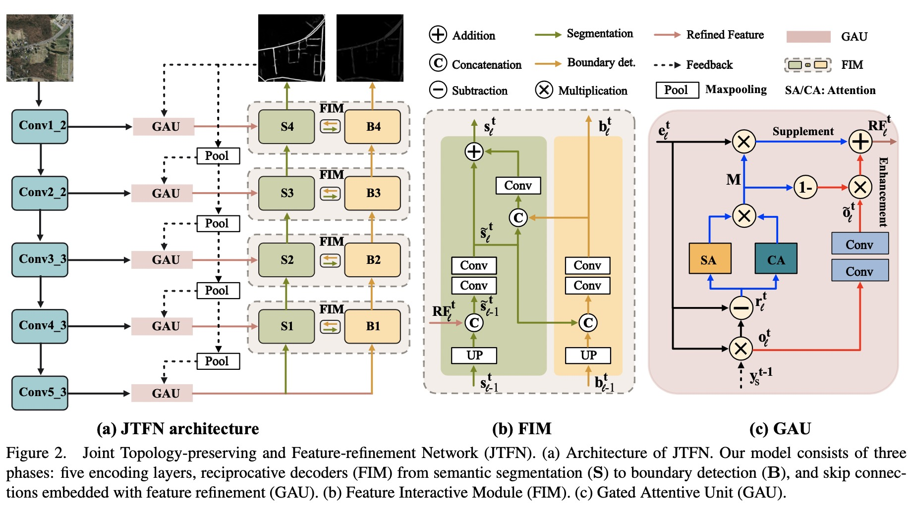

# Implementation of JTFN
Joint Topology-preserving and Feature-refinement Network for Curvilinear
Structure Segmentation  
Mingfei Cheng*, Kaili Zhao*, Xuhong Guo, Yajing Xu, and Jun Guo.  
[Accepted to ICCV 2021](https://openaccess.thecvf.com/content/ICCV2021/papers/Cheng_Joint_Topology-Preserving_and_Feature-Refinement_Network_for_Curvilinear_Structure_Segmentation_ICCV_2021_paper.pdf)

## Method


## Train and Test 
Requirements
```
Python 3.6
Pytorch 1.9.1
```
### dataset
Please download related datasets: [CrackTree200](https://github.com/fyangneil/pavement-crack-detection), [Crack500](https://github.com/fyangneil/pavement-crack-detection), [DRIVE](https://drive.grand-challenge.org/), [Roads](https://www.cs.toronto.edu/~vmnih/data/)  
Data folder structure:  
```
data/
├── split
│    ├──drive
│    │    ├── train.txt
│    │    └── test.txt
│    └──...
└── other data process files
datasets/
├── DRIVE
│   ├── images
│   │   ├── img1.tif
│   │   └── ...
│   ├── annotation_mask
│   │   ├── img1.png
│   │   └── ...
│   ├── annotation_boundary
│   │   ├── img1.png
│   │   └── ...
│   └── others
└── ...
```
We provide our script to generate boundary labels from annotations, your can run (Replace the folder path in brackets below):
```
python tools/produce_boundary.py --mask [annotation folder path] --save [generated boundary labels' path]
```
### train
Please modify the config and run:  
`sh train_jtfn.sh`
### test
Please modify the config and run:   
`sh test_jtfn.sh`  

### retained models
We provide our retrained models on Roads, DRIVE and Crack500 ([Baidu](https://pan.baidu.com/s/18TXR_WF_QRSLplq4q0WqxA), password:n14e; [Google](https://drive.google.com/drive/folders/1_H5yHegJYdbAW2m8QGvAuQG4pPbsPnqk?usp=sharing)):

| Dataset | F1 |
| ----- | ----- |
| DRIVE | 82.70 |
| Roads | 61.16 |
| Crack500 | 66.38 |


## Citation
If you use this code and our results for your research, please cite our paper.
```
@inproceedings{JTFN_ICCV_2021,
  title={Joint Topology-preserving and Feature-refinement Network for Curvilinear Structure Segmentation},
  author={Cheng, Mingfei and Zhao, Kaili and Guo, Xuhong and Xu, Yajing and Guo, Jun},
  booktitle={ICCV},
  year={2021}
}
```

